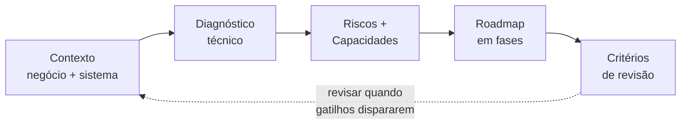

# Material de Encerramento — Canvas + Checklist

Use como **resumo visual final** da trilha e como **checklist** que o aluno leva para a vida.

### Como usar este material (didático)

- **Canvas (Seção A):** Serve para **resumir** um sistema ou um roadmap em uma única vista: contexto, estágio, riscos, decisões atuais, capacidades (existentes e a construir), trade-offs, métricas de sucesso e critérios de revisão. Use para comunicar “onde estamos” e “para onde vamos” em reuniões de arquitetura ou planejamento. Preencha os blocos com base no diagnóstico e no roadmap que você construiu no exercício.
- **Checklist (Seção B):** É um **guia de revisão** que você pode aplicar a qualquer sistema (ou ao seu próprio roadmap). As perguntas não têm “resposta certa” única; o objetivo é **provocar reflexão**: “Sabemos onde estão os gargalos?” “Os trade-offs estão claros?” Use em autoavaliação, em revisões de arquitetura ou ao onboardar alguém no sistema.

---

## A. Canvas da Jornada Arquitetural

Resumo visual em blocos. Preencha ou use como guia de discussão.

### Visão geral do fluxo (referência)

O diagrama resume o **fluxo** que sustenta um roadmap: contexto e diagnóstico alimentam a identificação de riscos e capacidades; o roadmap em fases mitiga riscos e constrói capacidades; critérios de revisão devolvem o ciclo ao contexto quando o cenário mudar.

| Bloco | Conteúdo (exemplos) |
|-------|----------------------|
| **Contexto do Negócio** | Estágio do produto, crescimento esperado, criticidade, regulatório |
| **Estágio do Sistema** | Monólito modular, 2 times, deploy semanal, observabilidade básica |
| **Principais Riscos** | Custo crescendo, poucos testes de carga, requisitos regulatórios, escala 5x |
| **Decisões Arquiteturais Atuais** | Manter monólito; BFF/orquestração; observabilidade básica |
| **Capacidades Técnicas Existentes** | Deploy automatizado, health checks, métricas básicas |
| **Capacidades a Construir** | Observabilidade padronizada, SLOs, testes de carga, golden paths |
| **Trade-offs Aceitos** | Deploy semanal por mais N meses; latência X em troca de custo Y |
| **Métricas de Sucesso** | Disponibilidade, latência p99, custo por request, tempo de deploy |
| **Critérios de Revisão** | 2x usuários, novo time, custo > Y, incidentes > N, mudança regulatória |

**Mensagem:** *Arquitetura é equilíbrio contínuo, não ponto final.*

---

## B. Checklist Final do Arquiteto

Checklist para levar para a vida. Use como autoavaliação ou revisão de sistemas.

### Arquitetura

- [ ] O sistema é **adequado ao estágio atual**? (não overengineered, não subdimensionado)
- [ ] As **decisões estão documentadas**? (ADRs, contexto, “por que”)
- [ ] Os **trade-offs estão claros**? (o que abrimos mão e por quê)

### Comunicação

- [ ] O **acoplamento é consciente**? (sabemos onde está e por que existe)
- [ ] **Eventos** são usados com propósito? (não por modismo; quando desacoplamento no tempo faz sentido)

### Observabilidade

- [ ] Sabemos **onde estão os gargalos**? (dados, não suposição)
- [ ] As **métricas refletem experiência real**? (incluindo cauda, erro, custo)

### Segurança

- [ ] **Identidade** é clara? (quem é quem; não só “está na rede interna”)
- [ ] **Dados** estão protegidos? (classificação, criptografia, lifecycle)
- [ ] **Logs** são seguros? (sem dados sensíveis; retenção definida)

### Confiabilidade

- [ ] **SLO** existe? (objetivo claro para disponibilidade e/ou latência)
- [ ] **Error budget** é conhecido? (e usado para priorizar?)
- [ ] **Aprendemos com falhas**? (post-mortem, melhorias)

### Performance

- [ ] **Latência de cauda** é medida? (p99, p999)
- [ ] **Gargalos** são conhecidos? (não chute)

### Custo

- [ ] Conhecemos **custo por request** (ou por transação relevante)?
- [ ] O custo **cresce onde deveria**? (ou há desperdício estrutural?)

### Padrões

- [ ] **Golden paths** existem? (caminho fácil = caminho correto)
- [ ] A **documentação está viva**? (atualizada, acessível)

---

## Frase final para encerrar a trilha

Você pode fechar com uma destas frases:

- *"Arquitetura não é sobre acertar tudo. É sobre tomar decisões melhores, com mais consciência, ao longo do tempo."*
- *"Você não sai daqui com respostas prontas. Você sai com critérios para decidir."*
- *"Arquitetura não é sobre acertar sempre. É sobre errar melhor, mais cedo e com menos impacto."*
- *"Bons arquitetos não preveem o futuro. Criam sistemas que conseguem evoluir."*

---

*Use o canvas para resumir o contexto e o roadmap; use o checklist para revisar sistemas e decisões ao longo da carreira.*
